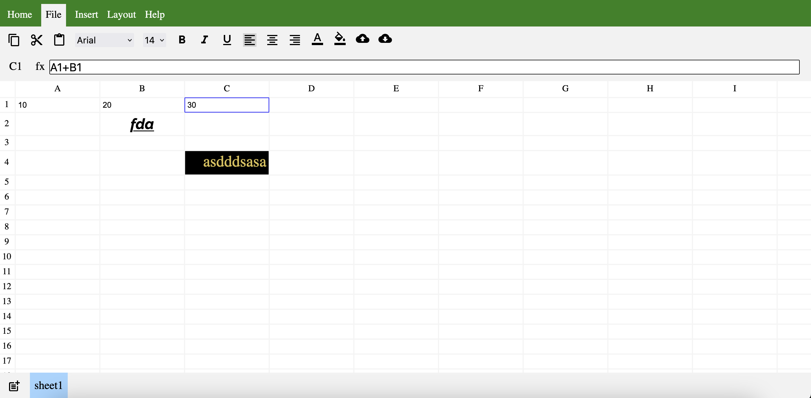

# Google Sheets Clone:

> A spreadsheet editing app build using Reactjs.




# 📊 Google Sheets Clone

A spreadsheet editing application built using React.js that mimics core functionalities of Google Sheets.


## ✨ Features

- 📝 Cell editing and formatting
- 🔢 Basic spreadsheet operations
- 📊 Grid layout with column and row headers
- 🎨 Formatting toolbar
- 💾 File menu options
- 🎯 Cell selection and range operations

## 🚀 Technologies Used

-  React.js for UI components
-  JavaScript (ES6+)
-  CSS3 for styling
-  HTML5

## 🛠️ Installation

1. Clone the repository:
```bash
git clone https://github.com/Ankit-Aslekar/google-sheet-clone.git
```

2. Navigate to the project directory:
```bash
cd google-sheet-clone
```

3. Install dependencies:
```bash
npm install
```

4. Start the development server:
```bash
npm start
```

## 💻 Usage

- Open the application in your browser
- Use the toolbar to format cells
- Enter data into cells
- Select cell ranges for operations
- Use the file menu for additional options

## 🤝 Contributing

Contributions, issues, and feature requests are welcome! Feel free to check the [issues page](https://github.com/Ankit-Aslekar/google-sheet-clone/issues).


## 👨‍💻 Author

**Ankit Aslekar**

* GitHub: [@Ankit-Aslekar](https://github.com/Ankit-Aslekar)

